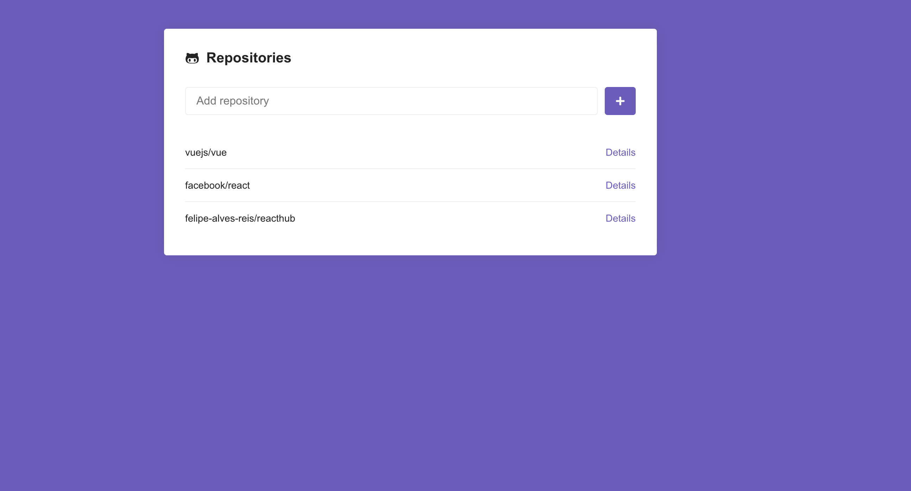

# ReactHub

ReactJS application that lists the repositories you add, searching for information on Github api and saving to local storage.

[Demo ReactHub](https://felipe-alves-reis.github.io/reacthub/#/)



## Installation

Use npm or yarn.

```bash
yarn or npm install
yarn start or npm start
```

## Libraries

* axios
* prop-types
* react-icons
* react-router-dom
* styled-components

## License
[MIT](https://choosealicense.com/licenses/mit/)
